# Business vibe coding architecture

## Purpose

The repository implements a file-driven research workflow for the question: **How does adding explicit OCL and natural-language Business Rules to use-case specifications affect AI-generated source code?**

It is not a set of continuously running AI services. Codex executes repository-local skills; files provide deterministic interfaces and evidence between steps.

## Two-phase architecture

```mermaid
flowchart LR
    R[Researcher]
    SHEET[Google Sheet A-B\nUC + UML + BR]
    FIGMA[Frozen Figma dataset]
    UC[Frozen UC projection]
    BASE[Business-rule baseline\nUC checksum + BR IDs]
    BR[Business Rule resource]
    P[Prompt A-F]
    APPROVE{Researcher approval}
    CONFIG[Confirmed experiment configuration]
    RUN[Run activation]
    SRC[finalsource/fe + finalsource/be]
    AUDIT[BR conformance audit]
    REPAIR[Bug-fixing sub-prompt]
    DOCKER[Docker build/runtime gate]
    FREEZE[Final source hash + run JSON]

    R --> CONFIG
    SHEET --> UC
    FIGMA --> P
    UC --> BASE
    BASE --> BR
    BR --> P
    UC --> P
    P --> APPROVE
    APPROVE -- Draft --> R
    APPROVE -- Approved --> RUN
    CONFIG --> RUN
    RUN --> SRC
    SRC --> AUDIT
    AUDIT -- evidenced defect --> REPAIR
    REPAIR --> SRC
    AUDIT -- all BRs assessed --> DOCKER
    DOCKER --> FREEZE
```



### Phase 1 - Generate Business Coding Prompt

Inputs:

- one frozen use-case Markdown file;
- UML Model and Business Rules embedded in that specification;
- OCL utility definitions;
- related API and UI identifiers;
- frozen Figma dataset where applicable;
- Prompt A-F template and project/database rules.

Processing:

1. Validate source provenance and UC identity.
2. Extract all unique BR IDs in source order; do not select a subset.
3. Copy each BR's OCL and natural-language constraints into a canonical Business Rule resource.
4. Record the UC checksum and BR IDs in `business-rule-baseline.json`.
5. Generate coding prompt:
   - For Full branch: Prompt A-F (Prompt E is an exact BR projection; A/D reference it; F sets context and priority).
   - For RQ3 branch: Prompt A-D (omitting E and F; A/D derive strictly from functional/UI/API specifications).
6. Stop at researcher approval.

Outputs:

```text
docs/02-construction/implementation/<UC-ID>/business-rule-baseline.json
docs/02-construction/business-rules/<UC-ID>-business-rules.json
docs/02-construction/coding-prompts/<UC-ID>-business-coding-prompt.md (Full)
docs/02-construction/coding-prompts/<UC-ID>-rq3-coding-prompt.md (RQ3)
```

### Phase 2 - Generate Source Code

Inputs:

- approved business coding prompt;
- Confirmed experiment configuration and active run receipt;
- current clean source baseline;
- project/database rules and frozen Figma inputs.

Processing:

1. Activate exactly one model/run before timing or source mutation.
2. Generate the smallest UC-scoped source diff through the React and/or NestJS skill.
3. Persist first-pass telemetry and BR assessments before any repair.
4. For each evidenced technical, business-rule, UI or flow defect, create one bounded sub-prompt and apply the smallest correction.
5. Reassess all frozen BRs without changing the denominator.
6. Run permitted validators, lint/typecheck/build and Docker runtime checks.
7. Freeze the final source hash and canonical run JSON.

## Prompt contract

| Prompt | Responsibility |
| --- | --- |
| A | Backend endpoint, business logic, server validation and errors |
| B | Frontend UI from Figma |
| C | Frontend state, API integration and success flow |
| D | Loading, client validation and API error behavior |
| E | Business Rules Compliance: Rule ID, OCL/NL constraints, layer and failure behavior |
| F | Implementation context, source priority and source-code-only restriction |

Priority is: Prompt E BRs; project/database rules; API contract; Figma; existing conventions. A conflict with higher-priority source is a researcher decision, not an AI inference.

## Evidence and metrics

The canonical run JSON records:

- experiment/model/run identity, replicate and run order;
- timing and token telemetry;
- UI/flow accuracy and complexity;
- exact UC/BR baseline checksum;
- one row per BR with `met`, `unmet` or `not_evaluable`;
- repair records categorized as `technical`, `business_rule`, `ui` or `flow`;
- build/runtime evidence and final source hash.

Prompt text alone cannot prove implementation. Evidence must point to inspectable source/configuration/build/runtime observations.

## Application-control boundary

Authentication, ownership, validation and related controls required by a UC or BR remain ordinary implementation behavior rather than a separate research dimension.

## Gates

- **Business-rule baseline:** deterministic Phase 1 receipt; all rules are included.
- **Prompt approval:** researcher changes Draft to Approved.
- **Schema approval:** researcher approves entity/migration changes.
- **Run activation:** exactly one configured model/run before Phase 2 mutation.
- **Completion:** all BR assessments plus build/runtime/final-source evidence.

## Test boundary

The research currently does not create or run tests. Source inspection, validators, lint, typecheck, builds, container health and bounded runtime observation are permitted.
