# Business vibe coding architecture

## Purpose

The repository implements a file-driven research workflow for the question: **How does adding explicit OCL and natural-language Business Rules to use-case specifications affect AI-generated source code?**

It is not a set of continuously running AI services. Codex executes repository-local skills; files provide deterministic interfaces and evidence between steps.

## Two-phase architecture

```mermaid
flowchart LR
    INPUT[Four prepared files and frozen dependencies] --> PREFLIGHT[Read-only preflight]
    PREFLIGHT --> PROMPT[1 Generate Draft prompt]
    PROMPT --> PCLOSE[2 Close prompt and approve]
    PCLOSE --> SOURCE[3 Generate first-pass source]
    SOURCE --> SCLOSE[4 Close source]
    SCLOSE --> AUDIT[5 Audit all BRs and flows]
    AUDIT -- defects with conclusive verdicts --> REPAIR[6 Requested repair and automatic verification]
    AUDIT -- unknown results --> FOLLOW[Save researcher verdicts or LLM measurement]
    FOLLOW -- defects remain; wait for command --> REPAIR
    AUDIT -- all pass; skip correction --> RCLOSE[7 Close repair]
    FOLLOW -- all pass; skip correction --> RCLOSE
    REPAIR --> RCLOSE
    RCLOSE --> FINAL[8 Finalize telemetry and report]
    FINAL --> EXPORT[9 Optional workbook export]
```

### Phase 1 - Generate Business Coding Prompt

Read [FILE-DRIVEN-WORKFLOW.md](docs/00-context/workflow/FILE-DRIVEN-WORKFLOW.md). The researcher prepares Confirmed configuration, frozen BR baseline, frozen flow baseline and Draft Canonical Run JSON before generation. Frozen UC/UML/API/Figma/resource/template dependencies must validate read-only. Generation never creates missing inputs.

Generate Draft Full A-F or RQ3 A-D with complete functional-flow coverage and the configured input boundaries. Capture actual prompt START/END and return the prompt-close command. That subsequent command approves and pins the Draft and closes telemetry, without another approval or activation turn.

### Phase 2 - Generate Source Code

Validate pinned configuration/approved prompt/closed prompt telemetry and cumulative source provenance. Optional historical activation is validated when present. Generate only first-pass source, preserve immutable hash/model/timing evidence, then stop before audit. The source-close command precedes directly requested BR/flow audit.

Audit persists every frozen result and source-linked evidence. All-passing unchanged-source audit records repair unnecessary. Unknown verdicts are saved as partial progress and completed by attributed researcher results or requested bounded LLM measurement. Neither audit nor follow-up automatically repairs source. The subsequent repair command supplies authorization, executes bounded corrections and automatically verifies final BR/flow/runtime evidence before freezing terminal hash/status. Close repair (or skipped repair), finalize and optionally export in successive turns.

## Prompt contract

| Prompt | Responsibility |
| --- | --- |
| A | Backend endpoint, business logic, server validation and errors |
| B | Frontend UI from Figma |
| C | Frontend state, API integration and success flow |
| D | Loading, client validation and API error behavior |
| E | Business Rules Compliance: Rule ID, OCL/NL constraints, layer and failure behavior |
| F | Implementation context, source priority and source-code-only restriction |

Priority is: Prompt E BRs; project/database rules; API contract; Figma; existing conventions. A conflict with higher-priority source is a researcher decision, not an AI inference.

## Evidence and metrics

The canonical run JSON records:

- experiment/model/run identity, replicate and run order;
- timing and token telemetry;
- UI/flow accuracy and complexity;
- exact UC/BR baseline checksum;
- one row per BR with `met`, `unmet` or `not_evaluable`;
- repair records categorized as `technical`, `business_rule`, `ui` or `flow`;
- build/runtime evidence and final source hash.

Prompt text alone cannot prove implementation. Evidence must point to inspectable source/configuration/build/runtime observations.

## Application-control boundary

Authentication, ownership, validation and related controls required by a UC or BR remain ordinary implementation behavior rather than a separate research dimension.

## Command boundaries

Each command authorizes its operation without further human gate confirmations. Existing canonical `gates` names are internal compatibility bookkeeping, recorded through `record_command.py`; historical receipts/evidence remain immutable. Concrete schema changes still need their approved proposal before entity/migration edits, and material specification ambiguity still needs researcher resolution. Optional UI scoring never blocks audit, telemetry, export or completion.

## Test boundary

The research currently does not create or run tests. Source inspection, validators, lint, typecheck, builds, container health and bounded runtime observation are permitted.

Prompt telemetry close (Turn 2) automatically creates a missing `run-activation.json` from the pinned configuration and approved prompt, or validates an existing receipt without replacing it. The receipt records the actual prompt-close turn/time, before source generation. No standalone activation turn is required.
