# Business vibe coding architecture

## Purpose

The repository implements a file-driven research workflow for the question: **How does adding explicit OCL and natural-language Business Rules to use-case specifications affect AI-generated source code?**

It is not a set of continuously running AI services. Codex executes repository-local skills; files provide deterministic interfaces and evidence between steps.

## Two-phase architecture

```mermaid
flowchart LR
    INPUT[Four prepared JSON files, per-run database baseline and frozen dependencies] --> PREFLIGHT[Read-only preflight]
    PREFLIGHT --> PROMPT[1 Generate Draft prompt]
    PROMPT --> PCLOSE[2 Close prompt and approve]
    PCLOSE --> SOURCE[3 Generate first-pass source]
    SOURCE --> SCLOSE[4 Close source]
    SCLOSE --> AUDIT[5 Audit all BRs and flows]
    AUDIT -- defects with conclusive verdicts --> REPAIR[6 Requested repair and automatic verification]
    AUDIT -- unknown results --> FOLLOW[Save researcher verdicts or LLM measurement]
    FOLLOW -- defects remain; wait for command --> REPAIR
    AUDIT -- all pass; skip correction --> FINAL[7 Close or skip Repair and finalize telemetry atomically]
    FOLLOW -- all pass; skip correction --> FINAL
    REPAIR --> FINAL
    FINAL --> EXPORT[8 Optional workbook export]
```

### Phase 1 - Generate Business Coding Prompt

Read [FILE-DRIVEN-WORKFLOW.md](docs/00-context/workflow/FILE-DRIVEN-WORKFLOW.md). The researcher prepares Confirmed configuration, frozen BR baseline, frozen flow baseline and Draft Canonical Run JSON before generation, plus the per-run database baseline and its configuration-pinned DBML. Frozen UC/UML/API/Figma/resource/template dependencies and database pins must validate read-only. Generation never creates missing inputs.

Generate [the configured prompt](docs/02-construction/coding-prompts/%3CUC-ID%3E-business-coding-prompt.md) as a Draft with complete functional-flow coverage and the configured input boundaries. Capture actual prompt START/END and return the prompt-close command. That subsequent command approves and pins the Draft and closes telemetry, without another approval or activation turn.

### Phase 2 - Generate Source Code

Validate pinned configuration/approved prompt/closed prompt telemetry and cumulative source provenance. Optional activation is validated when present. Generate only first-pass source, preserve immutable hash/model/timing evidence, then stop before audit. The source-close command precedes directly requested BR/flow audit.

Audit persists every frozen result and source-linked evidence. All-passing unchanged-source audit records repair unnecessary. Unknown verdicts are saved as partial progress and completed by attributed researcher results or requested bounded LLM measurement. Neither audit nor follow-up automatically repairs source. The subsequent repair command supplies authorization, executes bounded corrections and automatically verifies final BR/flow/runtime evidence before freezing terminal hash/status. The next `finalize-workflow` command closes or skips Repair and finalizes telemetry atomically. Optional export runs in a separate subsequent turn.

## Prompt contract

[The configured coding-prompt template](templates/construction/coding-prompt.template.md) defines all prompt structure and section responsibilities.

## Evidence and metrics

The canonical run JSON records:

- experiment/model/run identity, replicate and run order;
- timing and token telemetry;
- UI/flow accuracy and complexity;
- exact UC/BR baseline checksum;
- one row per BR with `met`, `unmet` or `not_evaluable`;
- repair records categorized as `technical`, `business_rule`, `ui` or `flow`;
- build/runtime evidence and final source hash.

Prompt text alone cannot prove implementation. Evidence must point to inspectable source/configuration/build/runtime observations.

## Application-control boundary

Authentication, ownership, validation and related controls required by a UC or BR remain ordinary implementation behavior rather than a separate research dimension.

## Command boundaries

Each command authorizes its operation without further human gate confirmations. Canonical `gates` names are internal command bookkeeping, recorded through `record_command.py`; recorded receipts/evidence remain immutable. Database structure is researcher-managed through TypeORM migrations between runs and immutable within each run: read the pinned DBML, verify migration history and hashes, and allow authorized business DML only. Missing structure blocks the run; baseline changes require researcher setup and a new configuration/run. Application rebuilds within runs use `--no-deps backend frontend`, never the setup migration service. Material specification ambiguity or input incompatibility requires researcher resolution. Optional UI scoring never blocks audit, telemetry, export or completion.

## Test boundary

The research currently does not create or run tests. Source inspection, validators, lint, typecheck, builds, container health and bounded runtime observation are permitted.

Prompt telemetry close (Turn 2) automatically creates a missing `run-activation.json` from the pinned configuration and approved prompt, or validates an existing receipt without replacing it. The receipt records the actual prompt-close turn/time, before source generation. No standalone activation turn is required.
