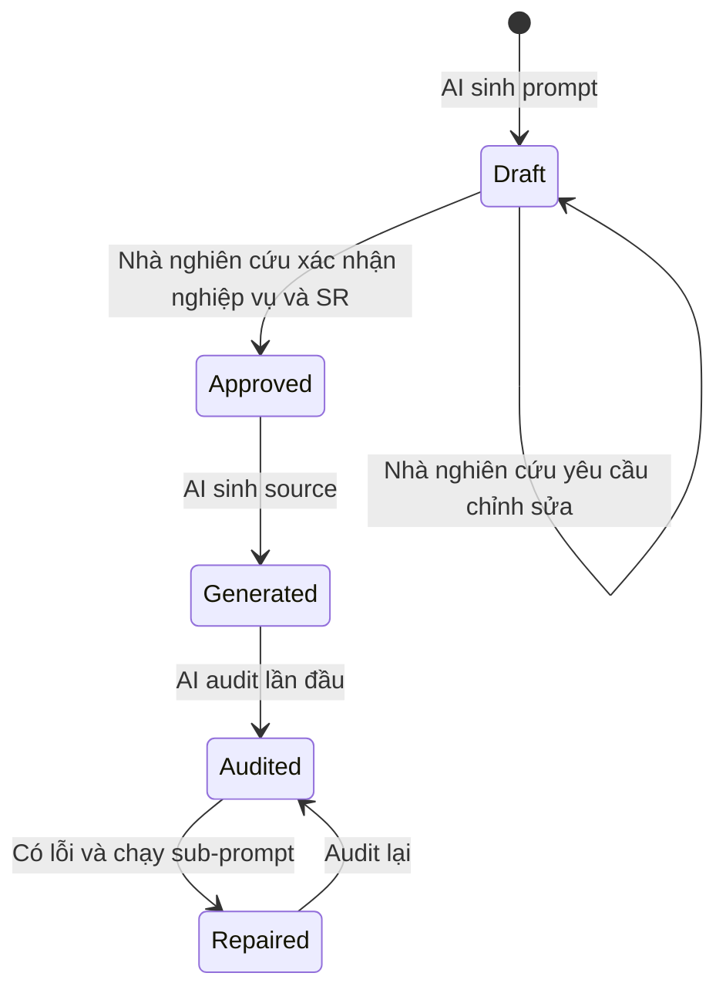
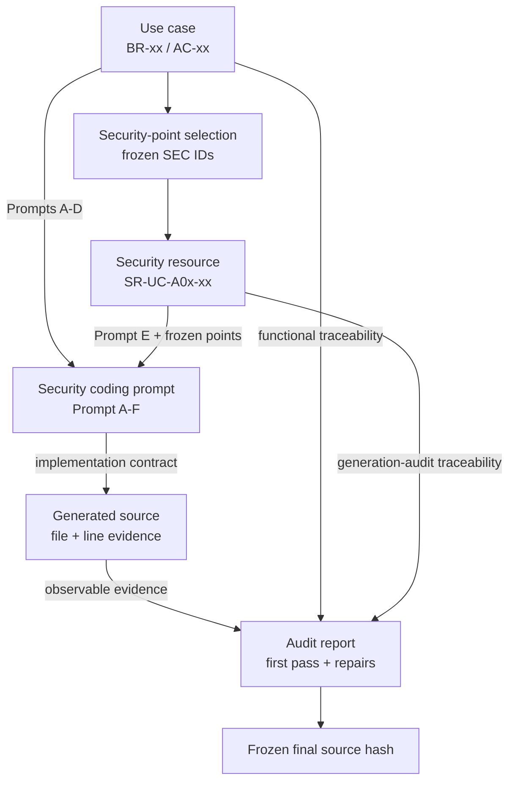
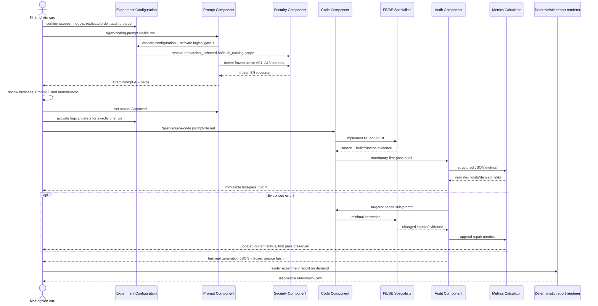

# Kiến trúc hệ thống Security vibe coding

## 1. Mục đích tài liệu

Tài liệu này mô tả kiến trúc, các AI component, artifact, luồng dữ liệu và cơ chế đánh giá của sản phẩm nghiên cứu Security vibe coding. Đối tượng đọc chính là nhà nghiên cứu và người phản biện cần hiểu hệ thống mà không phải đọc toàn bộ `.codex/skills` hoặc mã nguồn ứng dụng.

Security vibe coding nghiên cứu câu hỏi: **việc đưa tri thức bảo mật có cấu trúc vào security coding prompt ảnh hưởng như thế nào đến source code được AI sinh ra?**

Hệ thống chuyển một use case thành:

1. Yêu cầu nghiệp vụ có thể truy vết.
2. Yêu cầu bảo mật nguyên tử và đo được.
3. Security coding prompt hoàn chỉnh.
4. Mã nguồn frontend/backend.
5. Báo cáo thực nghiệm lần đầu và các lần sửa.

### Baseline và biến can thiệp

- **Baseline:** `resource/TechnicalReport.pdf` cung cấp nội dung chức năng cho Prompt A–D: backend/API, frontend/UI, integration/flow, validation/error handling.
- **Biến can thiệp của nghiên cứu:** Prompt E `SECURITY_REQUIREMENT` bổ sung các control active A01–A10 từ canonical generation catalog.
- **Thành phần bị loại:** `Prompt E: Business Rules Compliance` trong `resource/BUSINESS_PROMPT_TEMPLATE.docx` của bên tham khảo không được sử dụng và không được thay bằng một business-requirement prompt khác.
- **Không có business correctness metrics:** TechnicalReport/use case chỉ cung cấp baseline để sinh source. Metrics đếm kết quả chỉ áp dụng cho Prompt E Security Requirements.

## 2. Bản chất kiến trúc

Security vibe coding là một **repository-native, file-driven AI workflow**, không phải hệ thống nhiều AI service chạy thường trực.

- **Codex/LLM** là execution engine: đọc ngữ cảnh, suy luận, sinh artifact và sửa source code.
- **Codex skills** là các AI component chuyên môn: mỗi skill định nghĩa trách nhiệm, input, output và giới hạn hành vi.
- **Canonical JSON và exact prompt Markdown** là giao diện trao đổi giữa các component. Báo cáo Markdown được render on demand và không trở thành source of truth thứ hai.
- **Human approval** là control gate trước khi sinh source code.
- **Script metrics** là component tính toán xác định, dùng kiểm tra số học thay vì để LLM tự cộng bằng suy luận.
- **Figma và Google Sheets connectors** cung cấp dữ liệu thiết kế/nghiệp vụ bên ngoài khi use case tham chiếu đến chúng.

Thiết kế này giúp một lần thực nghiệm có thể được kiểm tra lại từ file input, prompt, source, evidence và báo cáo, thay vì phụ thuộc vào nội dung hội thoại không ổn định.

## 3. Phạm vi nghiên cứu

### 3.1 Phạm vi bảo mật

Run mới chỉ đưa hai nhóm sau của OWASP Top 10:2025 vào mẫu số thực nghiệm:

- `A01:2025`–`A10:2025` — 50 tiêu chí generation, 5 tiêu chí cho mỗi category.

Các dòng A03 được giữ để diễn giải artifact lịch sử nhưng không được chọn cho run mới.

Mỗi yêu cầu bảo mật nguyên tử áp dụng cho UC có giá trị đúng **1 điểm**. Danh sách và tổng điểm được khóa trước khi sinh source code.

### 3.2 Ngoài phạm vi

- Không đánh giá yêu cầu ngoài frozen A01–A10 denominator của run.
- Không sinh hoặc chạy test/test case.
- Không triển khai đầy đủ vai trò BA/Tech Lead/Developer/Tester của AI-DLC doanh nghiệp.
- Không yêu cầu PRD, TAR, Operations phase hoặc nhiều guard gate.
- Không yêu cầu nhà nghiên cứu paste prompt thủ công vào chat.
- Không hỗ trợ nhánh chạy native Node.js/MySQL; Docker Compose v2 là runtime bắt buộc cho generation gate.

Các kiểm tra được phép gồm đọc source/configuration/lockfile, build, lint, runtime evidence và software composition analysis (SCA). Đây là bằng chứng audit, không phải test-case generation.

## 4. Kiến trúc tổng thể

```mermaid
flowchart LR
    H["Nhà nghiên cứu"]
    UC["Use case Markdown\nAC / BR IDs"]
    CONFIG["Confirmed experiment configuration\nscopes + models + replicate/order"]
    SCOPE["Logical gate 1\nsecurity scope activation"]
    EXT["Figma + Google Sheets\nnguồn ngoài tùy chọn"]
    ORCH["AI Orchestrator\nrun-secure-aidlc"]
    SEC["Security Knowledge Component\ngen-security-coding-resource"]
    PROMPT["Prompt Engineering Component\ngen-coding-prompt"]
    GATE{"Prompt approval\nstatus: Approved?"}
    RUN["Logical gate 2\nrun activation"]
    CODE["Code Generation Component\ngen-source-code"]
    FE["React FE Specialist\nbuild-secure-react-frontend"]
    BE["NestJS BE Specialist\nbuild-secure-nest-backend"]
    SRC["finalsource/fe + finalsource/be"]
    AUDIT["Evaluation Component\naudit-generation-metrics"]
    CALC["Deterministic calculator\ncalculate_metrics.py"]
    REPORT["Canonical experiment JSON"]
    REPORTVIEW["Experiment Markdown\nrender on demand"]
    REPAIR["Bug-fixing Sub-prompt Component\nbug-fixing-sub-prompt"]
    FREEZE["Frozen final source hash"]

    H --> UC
    H --> CONFIG
    UC --> ORCH
    EXT -. "provenance-bound input" .-> PROMPT
    EXT -. "UI/business evidence" .-> AUDIT
    ORCH --> SCOPE
    CONFIG --> SCOPE
    SCOPE --> SEC
    ORCH --> PROMPT
    SEC --> PROMPT
    PROMPT --> GATE
    GATE -- "No / Draft" --> H
    GATE -- "Yes" --> RUN
    CONFIG --> RUN
    RUN --> CODE
    CODE --> FE
    CODE --> BE
    FE --> SRC
    BE --> SRC
    SRC --> AUDIT
    AUDIT --> CALC
    CALC --> REPORT
    REPORT -. "researcher requests view" .-> REPORTVIEW
    AUDIT -- "evidenced error" --> REPAIR
    REPAIR --> CODE
    AUDIT -- "repair terminal" --> FREEZE
```



## 5. Phân lớp kiến trúc

| Lớp | Thành phần | Trách nhiệm |
|---|---|---|
| Interaction | Nhà nghiên cứu, hai lệnh chính | Cung cấp UC, duyệt prompt, cung cấp quyết định và manual estimates |
| Orchestration | `run-secure-aidlc`, `gen-source-code` | Điều phối thứ tự component và điểm dừng |
| Knowledge/Prompt | `gen-security-coding-resource`, `gen-coding-prompt` | Biến UC và tri thức OWASP thành Prompt A–F |
| Implementation | React skill, NestJS skill | Sinh source theo technical stack và Prompt E |
| Generation evidence | Audit skill, calculator | Ghi source-based SR assessment, generation/repair telemetry và quản lý vòng sửa |
| Integration | Figma, Google Drive/Sheets | Đưa thiết kế và specification có provenance vào workflow |
| Artifact | `docs/`, `templates/`, `finalsource/` | Lưu trạng thái, hợp đồng và kết quả có thể truy vết |
| Governance | `AGENTS.md`, `PROJECT_CONTEXT.md`, approval gate | Ràng buộc phạm vi, ưu tiên và hành vi AI |
| Deployment support | `docker-deployment` | Review máy, cấu hình, chạy và xử lý lỗi Docker có lịch sử đã che secrets |

## 6. Các AI component

Repository hiện có 13 Codex skills: 9 workflow/component skills, 2 support skills và 2 deterministic report renderers. Mỗi skill có metadata kích hoạt trong `SKILL.md`, hướng dẫn thực thi, reference chuyên môn và trong một số trường hợp có script.

### 6.1 `run-secure-aidlc` — AI workflow orchestrator

**Vai trò:** cung cấp điểm vào end-to-end cho AI-DLC rút gọn.

**Input:** đường dẫn đến một file `uc-*.md`.

**Xử lý:**

1. Nhận use case.
2. Gọi component sinh prompt.
3. Dừng tại human approval gate.
4. Sau khi duyệt, gọi component sinh source.
5. Điều phối audit và repair loop.

**Output:** đường dẫn artifact hiện tại và hành động tiếp theo của nhà nghiên cứu.

**Giới hạn:** không tự thêm quy trình doanh nghiệp, test phase hoặc artifact ngoài nghiên cứu.

### 6.2 `gen-coding-prompt` — Prompt engineering component

**Vai trò:** biến use case thành security coding prompt mà nhà nghiên cứu không cần điền template thủ công.

**Input chính:** một file use case đã có actor, flow, AC/BR, dữ liệu và quyết định nghiệp vụ.

**Input bổ sung:** `PROJECT_CONTEXT.md`, templates, source provenance và security resource.

**Xử lý:**

- Chuẩn hóa UC ID, ví dụ `uc-1-login.md` thành `UC-001`.
- Kiểm tra ambiguity ảnh hưởng nghiệp vụ, authorization, API hoặc schema.
- Đọc Figma/Google Sheets nếu UC tham chiếu chính xác đến nguồn này.
- Gọi `gen-security-coding-resource`.
- Kết hợp yêu cầu nghiệp vụ, thiết kế, technical context và bảo mật vào Prompt A–F.

**Output:**

```text
docs/02-construction/security-resources/<UC-ID>-security.json
docs/02-construction/coding-prompts/<UC-ID>-security-coding-prompt.md
```

**Điểm kiểm soát:** Prompt được sinh ở trạng thái `Draft`; nhà nghiên cứu kiểm tra và chuyển thành `Approved`.

### 6.3 `gen-security-coding-resource` — Security knowledge component

**Vai trò:** chuyển các OWASP A01–A10 SEC đã chọn thành các control nhỏ cho Prompt E.

**Nguồn tri thức cho AI:** `docs/00-context/security/OWASP-2025-SECURITY-CATALOG.json` và security baseline của skill. File Markdown scoring chỉ là projection cho researcher.

**Xử lý:**

- Phân tích asset, actor, trust boundary, entry point, ownership, configuration và dependency change.
- Xét đúng active A01–A10 SEC theo mode `researcher_selected` hoặc `all_catalog`; không tự thay đổi danh sách researcher đã chọn.
- Sinh ID dạng `SR-<UC>-Axx-NN` từ SEC ID đã chọn.
- Ánh xạ SR với AC/BR, layer chịu ảnh hưởng và bằng chứng cần quan sát.
- Khóa danh sách SR và tổng điểm trước khi source generation.

Mỗi requirement theo cấu trúc:

```text
Security Requirement
├── OWASP category
├── SEC ID (canonical catalog identifier)
├── Source mappings and URLs
├── Security point: 1
├── Context & Threat
├── MUST DO
├── MUST NOT DO
└── Security Acceptance Criteria
```

**Output:** một security coding resource đóng vai trò single source of truth cho Prompt E.

### 6.4 `gen-source-code` — Source generation orchestrator

**Vai trò:** sinh source trực tiếp từ file security coding prompt đã duyệt.

**Input:** đường dẫn `*-security-coding-prompt.md` có `status: Approved`.

**Validation trước khi chạy:**

- Prompt có Prompt E và Prompt F.
- Truy vết được use case, security resource, AC/BR/SR.
- Không còn blocking decision.
- Artifact không trỏ bất ngờ ra ngoài repository.

**Xử lý:**

- Bắt đầu đo thời gian và lấy token telemetry khi nền tảng cung cấp.
- Khóa danh sách Security Requirements và baseline revision trước lần sinh đầu.
- Chọn FE skill, BE skill hoặc cả hai dựa trên phạm vi prompt.
- Chỉ ghi code trong `finalsource/`.
- Chạy build/lint/runtime check được phép.
- Gọi audit bắt buộc và lưu first-pass kể cả khi build/lint/runtime lỗi.
- Sau first-pass audit, gọi `bug-fixing-sub-prompt` cho từng repair iteration có bằng chứng rồi audit lại.

**Output:** source code, audit path, changed-file list và blocker nếu có.

### 6.5 `build-secure-react-frontend` — Frontend specialist

**Technical stack:** React 18, TypeScript, Vite 8, Tailwind CSS 3, React Router 7, Axios, Context/Zustand và Recharts.

**Trách nhiệm:**

- Thực thi Prompt B–E ở phía client.
- Tổ chức API client trong `src/api`, reusable UI trong `src/components`, view trong `src/pages`.
- Triển khai loading, empty, success và safe error states.
- Bảo đảm accessibility, responsive layout và type safety.
- Đọc đúng Figma frame/node trước khi code và khi audit UI.

**Security boundary:** frontend guard chỉ là UX control. Component không được coi state, route guard hoặc hidden button là authorization; backend vẫn là nguồn quyết định quyền.

**Các hành vi bị cấm:** unsafe HTML/eval, secret trong client, `any`, `@ts-ignore`, dependency mới không cần thiết, major upgrade hoặc hành vi UI/nghiệp vụ tự suy diễn.

### 6.6 `build-secure-nest-backend` — Backend specialist

**Technical stack:** NestJS 11, TypeScript, TypeORM 0.3, MySQL, class-validator/class-transformer, Passport JWT, bcrypt và Swagger.

**Trách nhiệm:**

- Thực thi Prompt A, D và E ở trusted server boundary.
- Tổ chức feature module theo controller/service/entity/DTO.
- Giữ controller mỏng; đặt business và ownership checks trong service.
- Validate DTO tại boundary và sử dụng repository injection.
- Chuẩn hóa lỗi an toàn và chọn rõ response fields.

**Security boundary:** authenticate API được bảo vệ; authorize cả action và object/tenant ownership; không tin `userId` do client gửi.

**Các hành vi bị cấm:** production `synchronize: true`, SQL nối chuỗi, mass assignment, weak hashing, hard-coded secret, sensitive logging, `any`, `@ts-ignore` hoặc dependency/endpoint/schema ngoài prompt.

### 6.7 `bug-fixing-sub-prompt` — Repair component

**Vai trò:** thực hiện đúng một repair iteration từ lỗi có bằng chứng sau khi first-pass audit đã được lưu.

**Xử lý:** phân loại lỗi `technical`, `security`, `ui` hoặc `flow`; tạo artifact `repair-NNN`; sửa source nhỏ nhất bằng skill FE/BE liên quan; chạy lại kiểm tra không phải test; ghi model, thời gian, token, file và evidence trước/sau; sau đó gọi audit lại. Mọi invocation tăng tổng sub-prompt, nhưng chỉ repair trực tiếp một frozen SR mới tăng security-repair subset.

**Bảo toàn nghiên cứu:** không sửa trước first-pass audit, không gộp lỗi không liên quan để giảm số lần đo, không ghi đè first-pass status và không thay đổi authorization, API, schema hay nghiệp vụ đã duyệt.

### 6.8 `audit-generation-metrics` — Evaluation component

**Vai trò:** đánh giá lần sinh đầu và mọi lần repair bằng cùng một rubric.

**Input:** approved UC, parent prompt, security resource, generated source/diff, telemetry, build/runtime/SCA evidence và Figma/Sheet evidence nếu có.

**Nhóm metrics:**

1. Model configuration: generation/audit/repair model ID, snapshot, reasoning settings, replicate và run order.
2. Security: tổng điểm, đạt, bị sót và chưa đánh giá của active A01–A10.
3. Efficiency: thời gian và token lần đầu/các sub-prompt/toàn UC.
4. Manual baseline: ba ước lượng độc lập của chuyên gia.
5. Supporting metadata: UI accuracy, flow accuracy và UC complexity.

**Quy tắc bảo toàn dữ liệu:** first-pass metrics là immutable. Repair chỉ cập nhật current status, không được ghi đè kết quả lần đầu hoặc thay đổi mẫu số SR.

**Canonical output:**

```text
docs/05-experiments/<UC-ID>/<run-id>.json
```

`$render-experiment-report` tạo Markdown on demand khi researcher/reviewer yêu cầu; Markdown không tham gia finalization.

### 6.9 `docker-deployment` — Environment and deployment support

**Vai trò:** enforce Docker Compose v2 là runtime bắt buộc, kiểm tra khả năng cài/chạy Docker trong môi trường nghiên cứu, hướng dẫn cấu hình local, build/start FE–BE–MySQL và xử lý lỗi deployment. Docker daemon unavailable là `BLOCKED`, không chuyển sang native runtime.

**Chế độ:** `review` chỉ đọc; `initialize` tạo cấu hình local sau phê duyệt; `run` build/start sau phê duyệt; `troubleshoot` xử lý từng lỗi có evidence. Skill phân biệt Docker CLI, daemon, container state, healthcheck và UI/API reachability.

**Persistent memory:** lưu environment review và incident fingerprint đã che secrets trong `docs/03-audit/docker-deployment/`. Skill không sinh feature/test, không commit `.env`, không tự reset database và không đưa deployment success vào security metrics.

### 6.10 Report renderer

`render-experiment-report` chuyển canonical run JSON thành report Markdown khi được yêu cầu. Renderer deterministic, ghi checksum của JSON nguồn và không reconcile thay đổi Markdown ngược về JSON.

### 6.11 `resolve-figma-design-dataset` — Design dataset support

**Vai trò:** resolve hoặc tạo checksum-verifiable offline Figma dataset theo mapping duy nhất trong `FIGMA-LINK-REVIEW.md`. Dataset frozen là visual input; skill không lấy URL/file key từ immutable UC để gọi Figma.

## 7. Component không phải AI nhưng quan trọng

### 7.1 Deterministic metrics calculator

File `.codex/skills/audit-generation-metrics/scripts/calculate_metrics.py`:

- Kiểm tra generation/repair timestamp, token và sub-prompt arithmetic.
- Với protocol v3, từ chối embedded security-tool evidence trong generation report.
- Từ chối security category ngoài phạm vi nghiên cứu.
- Tính coverage, tổng thời gian, tổng token, số sub-prompt, median/mean manual estimate và complexity level.
- Giữ `null` nếu telemetry không tồn tại; không đoán số liệu.

Việc tách calculator khỏi LLM giảm lỗi số học và tăng khả năng tái lập kết quả.

### 7.2 Human approval gate

Human-in-the-loop nằm giữa prompt generation và source generation:



Gate bảo vệ các quyết định mà AI không được tự chọn, đặc biệt là authorization policy, data ownership, public API, schema và residual risk.

### 7.3 Bug-fixing sub-prompt

Sub-prompt không phải prompt sinh lại toàn bộ ứng dụng. Nó là change request hẹp gồm:

- Error evidence cụ thể.
- AC/BR/SR ID bị ảnh hưởng.
- Root-cause objective.
- Ranh giới không được thay đổi nghiệp vụ, API, schema hoặc security policy.
- Yêu cầu sửa nhỏ nhất và audit lại.

Artifact được lưu tại:

```text
docs/02-construction/implementation/<UC-ID>/sub-prompts/
```

## 8. Artifact architecture và truy vết



### ID model

| ID | Ý nghĩa | Ví dụ |
|---|---|---|
| UC | Use case | `UC-001` |
| BR | Business rule | `BR-01` |
| AC | Acceptance criterion | `AC-01` |
| SR | Security requirement | `SR-UC-001-A01-01` |
| SEC ID | Tiêu chí chuẩn trong catalog nghiên cứu | `SEC-A01-03` |
| Run ID | Một lần thực nghiệm | Giá trị duy nhất theo run |
| Repair ID | Một sub-prompt sửa lỗi | `repair-001` |

Traceability cho phép trả lời: một yêu cầu đến từ đâu, nằm trong prompt nào, được triển khai ở file nào, đạt hay sót ở lần đầu và đã được sửa bởi sub-prompt nào.

## 9. Prompt architecture

Security coding prompt là hợp đồng trung gian giữa requirement và source. Nó không có Prompt Business Requirements/Business Rules Compliance độc lập:

| Prompt | Phạm vi |
|---|---|
| A | TechnicalReport baseline: backend endpoint, DTO, service, persistence, response/error contract |
| B | TechnicalReport baseline: frontend UI, Figma scope, component và interaction state |
| C | TechnicalReport baseline: frontend logic, API integration, state và navigation |
| D | TechnicalReport baseline: validation, loading, exception và safe error handling |
| E | Frozen active A01–A10 Security Requirements theo `format_security` |
| F | Project context, artifact provenance, ưu tiên và giới hạn sinh code |

Thứ tự ưu tiên khi có xung đột:

1. Approved TechnicalReport-derived functional requirements và API contract.
2. Prompt E Security Requirements.
3. Project rules và database schema.
4. Figma design.
5. Existing source conventions.

Nếu business requirement xung đột security policy hoặc còn mơ hồ ở quyết định quan trọng, AI phải dừng để yêu cầu quyết định thay vì tự thỏa hiệp.

## 10. External integration components

### 10.1 Figma connector

Được kích hoạt khi UC/prompt có Figma URL, file key, frame hoặc node ID.

- Đọc đúng node trước khi implement frontend.
- Ghi file/frame/node và thời điểm truy xuất vào provenance.
- Đọc lại cùng node để đánh giá UI accuracy.
- Dừng nếu inaccessible hoặc ambiguous; không đoán thiết kế.

### 10.2 Google Drive/Sheets connector

Được kích hoạt khi use case, business rules, API specification hoặc experiment input nằm trong Google Sheets.

- Chỉ đọc spreadsheet/tab/range đã chỉ định.
- Ghi spreadsheet ID, tab/gid, range và retrieval time.
- Dừng khi dữ liệu xung đột hoặc không truy cập được.
- Không ghi ngược lên Sheet nếu nhà nghiên cứu không yêu cầu rõ ràng.

Connector credentials không được lưu trong repository, prompt, source hoặc audit report.

## 12. Generated application architecture

`finalsource/` là output boundary duy nhất của source generation:

```text
finalsource/
├── fe/
│   └── src/
│       ├── api/          typed API clients
│       ├── assets/       static assets
│       ├── components/   reusable UI
│       ├── context/      shared React context
│       ├── hooks/        reusable hooks
│       ├── pages/        route-level views
│       ├── router/       route definitions/UX guards
│       └── utils/        shared utilities
└── be/
    └── src/
        ├── common/       shared guards/decorators/utilities
        ├── config/       validated configuration
        ├── database/     database connection/migrations support
        ├── filters/      normalized error handling
        ├── interceptors/ response/cross-cutting behavior
        └── modules/      feature controller/service/entity/DTO
```

Đây là cấu trúc đích kế thừa định hướng từ `VC-AWG-Demo_FinalCode-main`. Nội dung cụ thể được tạo dần theo các UC đã duyệt; sự tồn tại của thư mục không đồng nghĩa mọi feature đã được triển khai.

## 13. Cấu trúc repository

```text
security-vibe-coding/
├── .codex/skills/                    13 workflow/support/render skills
├── docs/
│   ├── 00-context/                   research, architecture, security scoring
│   ├── 01-inception/use-cases/       input UC
│   ├── 02-construction/
│   │   ├── security-resources/       Prompt E knowledge artifacts
│   │   ├── coding-prompts/           Prompt A-F artifacts
│   │   └── implementation/           selection, decisions, sub-prompts and state
│   ├── 03-audit/                     evidence, không chứa test case
│   └── 05-experiments/               canonical run JSON and metric schema
├── templates/
│   ├── inception/                    use-case shape
│   ├── construction/                 prompt/schema/security/repair shapes
│   ├── research/                     configuration, receipts and audit shapes
│   └── operations/                   Docker environment/incident shapes
├── finalsource/fe/                   React output boundary
├── finalsource/be/                   NestJS output boundary
├── AGENTS.md                         mandatory agent behavior
├── PROJECT_CONTEXT.md                canonical project context
├── README.md                          researcher operation guide
└── ARCHITECTURE.md                    this document
```

Tên `01-inception` và `02-construction` được giữ để tương thích reference architecture; người sử dụng chỉ cần hiểu workflow bốn bước, không phải vận hành một AI-DLC doanh nghiệp đầy đủ.

## 14. Template components

| Template | Chức năng |
|---|---|
| `inception/use-case.template.md` | Hình dạng UC; 16 UC nghiên cứu hiện có vẫn immutable |
| `construction/security-resource.template.json` | Canonical SR, điểm, acceptance và traceability |
| `construction/coding-prompt.template.md` | Exact Prompt A–F gửi cho model |
| `construction/schema.template.json` | Draft/Approved database decision trong một JSON |
| `construction/sub-prompt.template.md` | Repair prompt có giới hạn |
| `research/experiment-configuration.template.json` | Comparison group, security scope và run assignments |
| `research/run-activation.template.json` | Compact run gate receipt |
| `research/audit-run.input.json` | Canonical generation/audit metrics input shape |

Template tạo tính nhất quán giữa các use case và giảm độ tự do của AI ở các bước dễ gây sai số nghiên cứu.

## 15. End-to-end sequence



## 16. Các điểm kiểm soát chất lượng và an toàn

| Control | Mục đích |
|---|---|
| File as source of truth | Không phụ thuộc lịch sử chat hoặc prompt được paste thủ công |
| Stable AC/BR/SR IDs | Truy vết requirement → prompt → code → evidence |
| Approved status gate | Con người xác nhận trước khi sinh source |
| Frozen SR denominator | Tránh thay đổi thang điểm sau khi biết kết quả |
| Output boundary | Source chỉ được sinh trong `finalsource/` |
| Stack-specific skills | Áp dụng coding convention đúng React/NestJS |
| Backend-authoritative access control | Không nhầm frontend guard với bảo mật thực tế |
| Minimal repair prompt | Không phá nghiệp vụ đúng khi sửa một lỗi |
| Immutable first-pass record | Bảo toàn dữ liệu phục vụ nghiên cứu |
| Deterministic calculator | Kiểm tra số học và giới hạn active A01–A10 |
| Explicit null/unknown | Không bịa token, thời gian hoặc bằng chứng |
| No test-case generation | Giữ đúng phạm vi phương pháp nghiên cứu |

## 17. Khả năng tái lập và giới hạn

### So sánh nhiều model Codex

Model configuration là biến độc lập của thí nghiệm, không chỉ là metadata mô tả. `Sol Light` được chuẩn hóa thành `gpt-5.6-sol` + reasoning effort `low`; Luna và Terra dùng model ID `gpt-5.6-luna` và `gpt-5.6-terra` với effort được ghi rõ. Mỗi run lưu cả requested configuration và effective configuration/snapshot từ telemetry.

Generation model, audit model và model chạy từng repair được lưu riêng. Ba audit protocol được hỗ trợ:

- `fixed`: một auditor model cố định cho mọi output; phù hợp nhất để cô lập ảnh hưởng của generation model.
- `matched`: model sinh code tự audit output của chính nó.
- `cross`: mỗi output được nhiều model khác nhau audit và tạo record riêng theo cặp generator–auditor.

Mỗi biến thể phải bắt đầu từ cùng clean baseline, approved prompt revision và external-source snapshot. Không dùng source do một model đã sinh/sửa làm input cho model tiếp theo. Mỗi `UC × model × effort × replicate` có run ID và report riêng.

### Khả năng tái lập

Một run có thể được rà soát từ:

- Phiên bản use case và IDs.
- Security resource và mẫu số đã khóa.
- Prompt A–F đã duyệt.
- Model/version/parameters khi telemetry cung cấp.
- Source revision và changed files.
- Timestamp, token và evidence.
- Canonical audit JSON cùng repair history; Markdown có thể tái tạo on demand.

### Giới hạn

- Kết quả source có thể thay đổi theo model, phiên bản và sampling parameters.
- Token/time có thể là `null` nếu nền tảng không cung cấp telemetry.
- Code review/build/SCA evidence không chứng minh phần mềm không còn mọi lỗ hổng.
- Generation run operationalize và source-score các tiêu chí A01–A10 đã đóng băng; kết quả chỉ khẳng định mức đáp ứng Prompt E theo bằng chứng inspectable của run.
- UI accuracy phụ thuộc khả năng truy cập đúng Figma node.
- Manual estimate cần ba chuyên gia cung cấp độc lập; AI không tự tạo các giá trị này.

## 18. Điểm vào dành cho từng đối tượng

| Đối tượng | Nên đọc/chạy |
|---|---|
| Researcher mới clone repository | `README.md` → `CODEX_SETUP_GUIDE.md` → Setup Review; sau đó đọc `PROJECT_CONTEXT.md` |
| Nhà nghiên cứu/người phản biện | `ARCHITECTURE.md`, `PROJECT_CONTEXT.md`, security scoring và report được render từ canonical JSON |
| Nhà nghiên cứu vận hành thực nghiệm | `README.md`, `FILE-DRIVEN-WORKFLOW.md`, sau đó dùng hai lệnh chính |
| Người thiết kế nghiên cứu | `METRICS-SCHEMA.md`, templates và audit skill |
| Người review security | Security resource, Prompt E và source-based assessment evidence |
| Người review kỹ thuật | Technical-stack rules, FE/BE skills và `finalsource/` |

Hai lệnh vận hành chính vẫn là:

```text
$gen-coding-prompt docs/01-inception/use-cases/<uc-file>.md
$gen-source-code docs/02-construction/coding-prompts/<UC-ID>-security-coding-prompt.md
```
